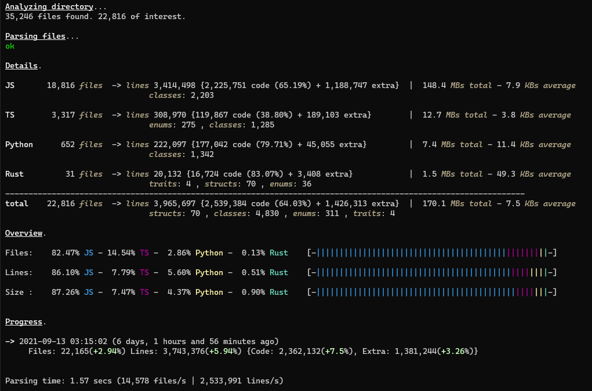

# code_stats

## About
This is a <b>fast</b>, <b>customizable</b> and fairly <b>accurate</b> stats generator for programming projects, in the form of a CLI executable, written in <b>Rust</b>, with <b>minimal dependencies</b>. It is used for counting total lines, code lines, and user defined <b>keywords</b> like classes.

Example run:



## Table of contents
* [How To Run](#how-to-run)
* [Supported Languages](#supported-languages)
* [Details](#details)
* [Performance](#performance)
* [Limitations](#limitations)


## How To Run
You can run the project directly by dowloading the "target/release" folder that contains the executable and the neccessary "data" folder.
Alternatively, you can build the project yourself "cargo b --release".

Format of arguments: <path_here> --optional_command1 --optional_commandN

The program, expects a path to a directory or a code file, that can be provided as cmd argument, or if not, you will be prompted to provide it after running the program.
The program also accepts a lot of optional flags to customize functionality, see the 
[Details](#details) section for more info or use the --help command.


## Supported Languages
All the supported languages can be found in the folder "data/extensions" as seperate text files. 
The user can easily specify a new language by replicating the format of the extension files and customizing it accordingly, either by following the rules below or by copy pasting an existing file.

The format of the extensions is as follows(and should not be modified at all):

```
Extension
<name of file extension like java or py>

String symbols
<either 1 or two string symbols seperated by space, like: " ' >

Comment symbol
<single line comment symbol like: //>

```
all the following lines are optional and can be omitted
```
Multiline comment start symbol
<a symbol like: /*>

Multiline comment end symbol
<a symbol like: */>

Keyword
    name
    <the name of the keyword to be shown in the results, like: classes>
    aliases
    <any word that constitutes an instance of this keyword, like: class, record>
Keyword
    name
    <the name of the keyword to be shown in the results, like: classes>
    aliases
    <any word that constitutes an instance of this keyword, like: class, record>
```
	
## Details
The program requires a "data" dir to be present on the same level as the executable(or 2 levels up in the folder hierarchy). In the "data" dir an "extensions" dir must be present, that contains the supported extensions. An optional "config" dir may be present too, where the user can specify persistent settings, more on that later.

The program counts the lines of files in the specified directory. In order for a file to be considered for counting, it's extension must be supported, meaning that a .txt file specifying the details of the extension must be present in the "data/extensions" dir see [Supported Languages](#supported_languages). 

The program distinguishes the total lines in code lines and "extra" lines (all the lines that are not code).
<b>Note</b> that braces "{ }" are not considered as code by default, but this can be changed by using the --braces-as-code flag.
Also, the program can search for user-defined <b>keywords</b> that are specified in the extensions files and count their occurances. 

The program can identify keywords in <b>complex lines</b> correctly, meaning that it will check whether the keyword is inside a comment, a string, if it has a prefix or suffix and will not consider it.

Below there is a list with all the commands-flags that the program accepts.
```
--help
    Display this message on the terminal. No other arguments or commands are required.
    
--path
    The path to a directory or a single file, in this form: '--path <path_here>'
    It can either be surrounded by quotes: "path" or not, even if the path has whitespace.

    The path can also be given implicitly (in which case this command is not needed) with 2 ways:
    1) as the first argument of the program directly
    2) if it is present in a configuration file (see '--save' and '--load' commands).

--exclude 
    1..n arguments separated with whitespace, can be a folder name or a file name (including extension).

    The program will ignore these dirs.

--extensions 
    1..n arguments separated with whitespace, can either have a dot prefix or not (.java or java)

    The given extension names must exist in any of the files in the 'data/extensions/' dir as the
    parameter of the field 'Extension'.

    Only the extensions specified here will be taken into account for the stats.

--threads
    1 argument: a number between 1 and 8. Default: 4 

    This reprisents the number of the consumer threads that parse files,
    there is also always one producer thread that is traversing the given dir.

    Increasing the number of consumers can help performance a bit in a situation where
    there are a lot of big files, concentrated in a shallow directory structure.
    
--braces-as-code
    No arguments in the cmd, but if specified in a configuration file use 'true' or 'yes' to enable,
    or anything else to disable. Default: disabled

    Specifies whether lines that only contain braces, should be considered as code lines or not.

    The default behaviour is to not count them as code, since it is silly for code of the same content
    and substance to be counted differently, according to the programer's code style.
    This helps to keep the stats clean when using code lines as a complexity and productivity metric.

--search-in-dotted
    No arguments in the cmd, but if specified in a configuration file use 'true' or 'yes' to enable,
    or anything else to disable. Default: disabled

    Specifies whether the program should traverse directories that are prefixed with a dot,
    like .vscode or .git.

--show-faulty-files
    No arguments in the cmd, but if specified in a configuration file use 'true' or 'yes' to enable,
    or anything else to disable. Default: disabled

    Sometimes it happens that an error occurs when trying to parse a file, either while opening it,
    or while reading it's contents. The default behavior when this happens is to count all of
    the faulty files and display their count.

    This flag specifies that their path, along with information about the exact error is displayed too.
    The most common reason for this error is if a file contains non UTF-8 characters. 

--save
    One argument in the form of a file name (whitespace allowed, without an extension)

    If we plan to run the program many times for a project, it can be bothersome to specify,
    all the flags every time, especially if they contain a lot of exclude dirs for example.
    That's why you can specify all the flags once, and add this command to save them
    as a configuration file. 

    Doing so, will run the program and also create a .txt configuration file,
    inside 'data/config/' with the specified name, that can later be loaded with the '--load' command.

<b>--load</b>
    One argument in the form of a file name (whitespace allowed, without an extension)
    
    Assosiated with the '--save' command, this comman is used to load the flags of 
    an existing configuration file from the 'data/config/' directory. 

    There is already a configuration file named 'default.txt' that contains the default of the program,
    and gets automatically loaded with each program run. You can modify it to add common flags
    so you dont have to create the same configurations for different projects.

    If you provide in the cmd a flag that exists also in the provided config file,
    then the value of the cmd is used. The priority is cmd> custom config> default config. 
    You can combine the '--load' and '--save' commands to modify a configuration file.
```

## Performance
On a cold run, performance is mainly limited by how fast the producer thread can traverse the directory and find relevant files, so the consumers can parse them.

The performance will also vary depending depending on how deep and wide the directory structure is, how big the code files are and how many keywords are specified to be counted. 

Here are some metrics for both hot and cold executions on my laptop (i5-1035G1, 2 keywords per language, 6 languages specified):

1) reletively deep and wide directory with big files (6 consumers)
```
4,066 files - lines 5,625,944 - average size 75 KBs

Hot
 1.13 secs (Parsing: 3649 files/s | 5,050,219 lines/s)
Cold
 1.61 secs (Parsing: 2528 files/s | 3,498,721 lines/s)
```
2) relatively deep and wide directory with average to small files (4 consumers)
```
3,824 files - lines 793,751 - average size 8.7 KBs

Hot
 0.29 secs 
Cold
 1.23 secs (Parsing: 3106 files/s | 644,801 lines/s)
```
3) very very deep and wide directory, my entire drive (4 consumers)
```
32,078 files - lines 15,101,949 - average size 21 KBs 

Hot
 11.59 secs (Parsing: 2807 files/s | 1,317,336 lines/s)
Cold
 36.21 secs (Parsing: 891 files/s | 418,475 lines/s)
```
	
## Limitations
- Although the program can understand a complex line like: ```/*class"*/" "class" aclass``` and will not count "class" as a keyword since the first is inside a comment, the second inside a string and the third has a prefix, it cannot understant language specific syntax. This may lead to some false positives if a keyword can be used in a language to have a different semantic meaning than its primary one.

- The program assumes that if a line contains any odd number of the same string symbols, then this is an open multiline string. This works for most cases but it may create inaccuracies, for example if a line in python has """ then the program will consider a multiline string everything until the next " symbol and not the next """ symbol. If a language doesn't support multiline strings, then you would not expect to see odd number of string symbols either way in a valid syntnax.

- A language can only have either one or two string symbols, not more.
