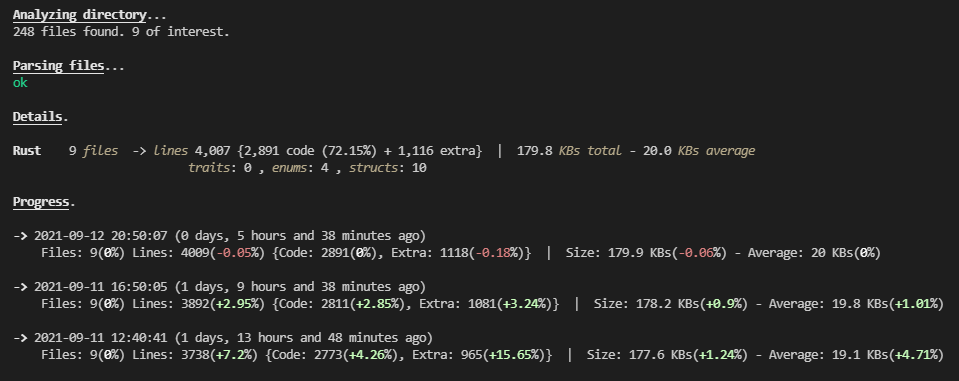

# mezura

## About
This is a fairly <b>fast</b>, fairly <b>accurate</b>, very <b>customizable</b> stats generator for programming projects, in the form of a CLI executable, written in <b>Rust</b>.
It is used for counting total lines, code lines, user defined <b>keywords</b> like classes, enums, etc., visualize the statistics, and to track the growth of codebases.<br><br>
It is maintained primarily on <b>Windows</b>, it is also being validated that it works on <b>Linux</b> (Ubuntu), and it probably also works on <b>MacOS</b> (although I cannot personally verify).

Example run:


## Table of contents
* [How To Run](#how-to-run)
* [Details](#details)
* [Cmd Commands](#cmd-commands)
* [Configuration Files](#configuration-files)
* [Logs and Progress](#logs-and-progress)
* [Supported Languages](#supported-languages)
* [Accuracy and Limitations](#accuracy-and-limitations)
* [Performance](#performance)
* [Similar Projects](#similar-projects)


## How To Run
The only thing you need is the binary. You can either:
1) ```cargo install --git https://github.com/subamanis/mezura --branch main```
2) Build yourself by cloning or downloading the repo (```cargo build --release```),
3) For Windows only, grab the prebuilt binary from the "executable" folder.

And to run it:
```mezura <optional_path> --optional_command1 --optional_commandN``` 

The program, expects none or many paths to some directories or code files, seperated by comma, if more than one.
If no path is provided, the current working dirrectory will be assumed as target directory.

The program also accepts a lot of optional flags to customize functionality, see [Cmd Commands](#cmd-commands) for more info or use the --help command.

	
## Details
The generated stats are the following:
- Number of files
- Lines (code + others) and percentages
- Size (total and average) 
- Keyword occurances
- Percentage comparisons between languages
- Difference of stats between executions 

There is a "data" folder in the repository, that contains some already provided language files and the default configuration file.
The program, at compile time, includes the "data" folder in the binary, and during the first execution, it saves it with the same structure in a persistent path, inside the user's computer, according to the platfrom's specification. More specifically, the paths per operating system are:
```
    Windows:  C:/Users/<user_name>/AppData/Roaming/mezura
    Linux:    /home/<user_name>/.local/share/mezura
    MacOs:    /Users/<user_name>/Library/Application Support/mezura
```

After every subsequent execution, the languages, configurations and logs, are read from these folders, so the user can have easy access and modify them,
like add more languages of his choice, or modify the default configuration.

In order for a file to be considered for counting, its extension must be supported, meaning that a .txt language file specifying the particular extension as an entry in its 'Extensions' field, must be present in the "data/languages" dir see [Supported Languages](#supported-languages). 


## Cmd Commands
Below there is a list with all the commands-flags that the program accepts.
```
--help
    No arguments or any number of existing other commands.

    Overrides normal program execution and just displays this message on the terminal.
    If more commands are provided, information will be displayed specifically about them.

--changelog
    No arguments.

    Overrides normal program execution and just prints a summary of the changes of every previous version of the program

--show-languages
    No arguments.

    Overrides normal program execution and just prints a sorted list with the names of all the supported languages
    that were detected in the persistent data path of the application, where you can add more.

--show-configs
    No arguments.

    Overrides normal program execution and just prints a sorted list with the names of all the configuration files
    that were detected in the persistent data path of the application. 

--dirs
    The paths to the directories or files, seperated by commas if more than 1,
    in this form: '--dirs <path1>, <path2>'
    If you are using Windows Powershell, you will need to escape the commas with a backtick: ` 
    or surround all the arguments with quatation marks:
    <path1>`, <path2>`, <path3>   or   "<path1>, <path2>, <path3>"

    The target directories can also be given implicitly (in which case this command is not needed) with 2 ways:
    1) as the first arguments of the program directly
    2) if they are present in a configuration file (see [Configuration Files](#configuration-files)).

--exclude 
    1..n arguments separated by commas, can be a folder name, a file name (including extension), 
    or a full path to a folder or file.
    If you are using Windows Powershell, you will need to escape the commas with a backtick: ` 
    or surround all the arguments with quatation marks:
    <arg1>`, <arg2>`, <arg3>   or   "<arg1>, <arg2>, <arg3>"

    The program will ignore these dirs.

--languages 
    1..n arguments separated by commas, case-insensitive

    The given language names must exist in any of the files in the 'data/languages/' dir as the
    parameter of the field 'Language'.

    Only the languages specified here will be taken into account for the stats.

--threads
    2 numbers: the first between 1 and 4 and the seconds between 1 and 12. 

    This represents the number of the producers (threads that will traverse the given directories),
    and consumers (threads that will parse whatever files the producers found).

    If this command is not provided, the numbers will be chosen based on the available threads
    on your machine. Generally, a good ratio of producers-consumers is 1:3
    
--braces-as-code
    No arguments in the cmd, but if specified in a configuration file use 'true' or 'yes' to enable,
    or 'no' to disable. Default: no 

    Specifies whether lines that only contain braces, should be considered as code lines or not.

    The default behaviour is to not count them as code, since it is silly for code of the same content
    and substance to be counted differently, according to the programer's code style.
    This helps to keep the stats clean when using code lines as a complexity and productivity metric.

--search-in-dotted
    No arguments in the cmd, but if specified in a configuration file use 'true' or 'yes' to enable,
    or 'no' to disable. Default: no 

    Specifies whether the program should traverse directories that are prefixed with a dot,
    like .vscode or .git.

--show-faulty-files
    No arguments in the cmd, but if specified in a configuration file use 'true' or 'yes' to enable,
    or 'no' to disable. Default: no 

    Sometimes it happens that an error occurs when trying to parse a file, either while opening it,
    or while reading it's contents. The default behavior when this happens is to count all of
    the faulty files and display their count.

    Specifies that their path, along with information about the exact error is displayed too.
    The most common reason for this error is if a file contains non UTF-8 characters. 

--no-visual
    No arguments in the cmd, but if specified in a configuration file use 'true' or 'yes' to enable,
    or 'no' to disable. Default: no 

    Disables the colors in the "overview" section of the results, and disables the visualization with 
    the vertical lines that reprisent the percentages.

--save
    One argument as the file name (whitespace allowed, without an extension, case-insensitive)

    Doing so, will run the program and also create a .txt configuration file,
    inside 'data/config/' with the specified name, that can later be loaded with the --load command.

--load
    One argument as the file name (whitespace allowed, without an extension, case-insensitive)
    
    Assosiated with the '--save' command, this command is used to load the flags of 
    an existing configuration file from the 'data/config/' directory. 

    You can combine the '--load' and '--save' commands to modify a configuration file.

--log 
    0..n words as arguments in the cmd.
    If specified in a configuration file use 'true' or 'yes' to enable,
    or 'no' to disable. Default: no 

    This flag only works if a configuration file is loaded. Specifies that a new log entry should be made
    with the stats of this program execution, inside the appropriate file in the 'data/logs' directory.
    If not log file exists for this configuration, one is created.
    All the provided arguments are used as a description of the log entry.

--compare
    1 argument: a number between 0 and 10. Default: 1

    This flag only works if a configuration file is loaded. Specifies with how many previous logs this
    program execution should be compared to (see [Logs and Progress](#logs-and-progress)).

    Providing 0 as argument will disable the progress report (comparison).
```


## Configuration Files
If we plan to run the program many times for a project, it can be bothersome to specify all the flags every time, especially if they contain a lot of target and exclude dirs.
That's why you can specify many flags in a <b>*configuration file*</b>, and have the program just load that file (see the --load command). <br>

Configurations can be created automatically by specifying all the flags once, along with the command "--save", and a name for the configuration. Then the program, along with its normal execution, will automatically create a config file with the name you specified, and dump all the flags in there. <br>
The next time you want to run the program on this project, you can do it like this: 
```mezura --load <config_name>``` <br>

By default, there is a configuration file name "default" already present in the "data/config" dir, that gets loaded on every run. There, you can customize your preferences and they will apply to all runs, except if overriden by explicitely providing a different flag in the cmd, or by loading a specific configuration. For example, if you prefer counting braces as code, you can specify it there, because the default behaviour is to not regard them as code. <br>

The priorities of the specified flags are:
1) cmd
2) Specific config file
3) Default config file
4) Internal defaults


## Logs and Progress
Inside the 'data/logs' folder, the program will save log files that correspond to saved configurations everytime the '--log' flag is used. <br>
Inside the log files, the date and time of the execution and the name of the log (if specified) are saved, along with information about the current configuration (like the target directories, whether braces should be considered code, etc, so you can see if at some point the configuration got modified), and also the total files, lines, code lines,
extra lines, size and average size of the execution. They are in an easy to parse format for external use also. <br>

By using the '--compare <N>' flag, the (N) previous logged executions will be retrieved from the file and will be compared and printed to the screen. For example
for N = 3, it would look like this:


Note that a configuration file must be loaded for both '--log' and '--compare' to work.


## Supported Languages
Note that the default supported languages are incomplete, but they can be easily expanded by the user. All the supported languages can be found in the folder "data/languages"
as seperate text files, in the persistent data path of the application. 
The user can easily specify a new language by replicating the format of the language files and customizing it accordingly, either by following the rules below or by copy pasting an existing file.

The format of the languages is as follows(and should not be modified at all):

```
Language
<name of the language>

Extensions
<name of file extensions like cpp hpp or py, seperated by whitespace>

String symbols
<either 1 or 2 string symbols, seperated by whitespace, like: " ' >

Comment symbols
<either 1 or 2 single line comment symbols, seperated by whitespace, like: // # >

```
All the following lines are optional and can be omitted. You can also specify an arbitrary amount of keywords.
```
Multiline comment start symbol
<a symbol like: /*>

Multiline comment end symbol
<a symbol like: */>

Keyword
    NAME
    <the name of the keyword to be shown in the results, like: classes>
    ALIASES
    <any word that constitutes an instance of this keyword, like: class, record>
Keyword
    NAME
    <the name of the keyword to be shown in the results, like: classes>
    ALIASES
    <any word that constitutes an instance of this keyword, like: class, record>
```

	
## Accuracy and Limitations
The program is able to understand and parse correctly arbitrarily complex code structures with intertwined strings and comments. This way it can identify if a line contains something other than a comment, even if the comment is partitioned in multiple positions and it can identify valid keywords, that are not inside strings or comments.
For example in a line like ```/*class"*/" class" aclass```, it will not count "class" as a keyword since the first is inside a comment, the second inside a string and the third has a prefix.
Additionally:
- It checks for escaped characters, for example ```/"``` will not be counted as a string symbol
- It resolves symbols that are side by side, for example ```*/*``` is normally identified as both a closing and an opening comment symbol, but the program will understand the correct usage.

With that said, it is important to mention the following limitations:

- The program cannot understand language specific syntax or details, this would require a handwritten, complex, language-specific parser for most different languages. For example, in a .php file that contains html or js, the destinction will not be made. Also, the keyword counting doesn't take any measures to ensure that a valid keyword has the user-intended meaning. For example, the word "class" may appear in the syntax of a programming language with an additional use than declaring a class. This may lead to some false positives.

- The program assumes that if a line contains any odd number of the same string symbols, then this is an open multiline string. This works for most cases but it may create inaccuracies, for example if a line in python has """ then the program will consider a multiline string everything until the next " symbol and not the next """ symbol. If a language doesn't support multiline strings, then you would not expect to see odd number of string symbols either way in a valid syntnax.

- A language can only declare either one or two string and comment symbols and only one multiline comment start symbol + multiline comment end symbol in the .txt, not more.

- The program doesn't take into account gitignore files, the unwanted dirs have to be added manually in a configuration file or using the ```--exclude``` command. 

- Regural expressions are not handled in a special way, so if a regex contains a string or comment symbol, it may create some inaccurancies for the file.

- Bug: If a file contains Unicode Strings, there is a possibility that a parser thread will panic, due to trying to slice a line in a non-valid way, thus creating
non-valid unicode characters. (byte index is not a char boundary)


## Performance
The performance of the program will scale with the available logical cores (threads) of the machine. The default behaviour, if the '--threads' command
is not specified, is to detect the available threads of the machine and choose accordingly how many producers and consumers it will spawn, so
by default the program will run close to maximum performance. You can try to manually tweek the number of threads and the producer to consumer ratio though.

The performance will also vary depending on how deep and wide the directory structure is, how big the code files are, the ratio of relevant to irrelevant files, 
and how many keywords are specified to be counted. 

Here are some metrics for both hot and cold executions on my laptop (Sata3 SSD, i5-1035G1 (4 cores - 8 threads)):

1) shallow directory with small files (1 consumers 3 producers)
```
3,247 total / 125 relevant files - lines 16,298 - average size 4.5 KBs

Hot
 0.02 secs
Cold
 0.06 secs
```

2) reletively deep and wide directory with big files (3 consumers 6 producers)
```
30,121 total / 4,066 relevant files - lines 5,625,944 - average size 75 KBs

Hot
 1.05 secs (Parsing: 3939 files/s | 5,451,219 lines/s)
Cold
 2.67 secs (Parsing: 1526 files/s | 2,121,721 lines/s)
```

3) very very deep and wide directory, my entire drive (3 producers - 6 consumers)
```
615,302 total / 40,156  relevant files - lines 16,819,949 - average size 25 KBs 

Hot
 8.92 secs (Parsing: 4520 files/s | 1,893,336 lines/s)
Cold
 22.11 secs (Parsing: 1817 files/s | 761,475 lines/s)
```


## Similar Projects

If you don't require the keyword counting functionality of this program, the progress tracking feature, or the alternate-than-usual visualization, use the [scc](https://github.com/boyter/scc) project written in GO, that is honestly impressive.

Other alternative projects you can check are:
- [loc](https://github.com/cgag/loc)
- [cloc](https://github.com/AlDanial/cloc)
- [sloc](https://github.com/flosse/sloc)
- [tokei](https://github.com/XAMPPRocky/tokei)
