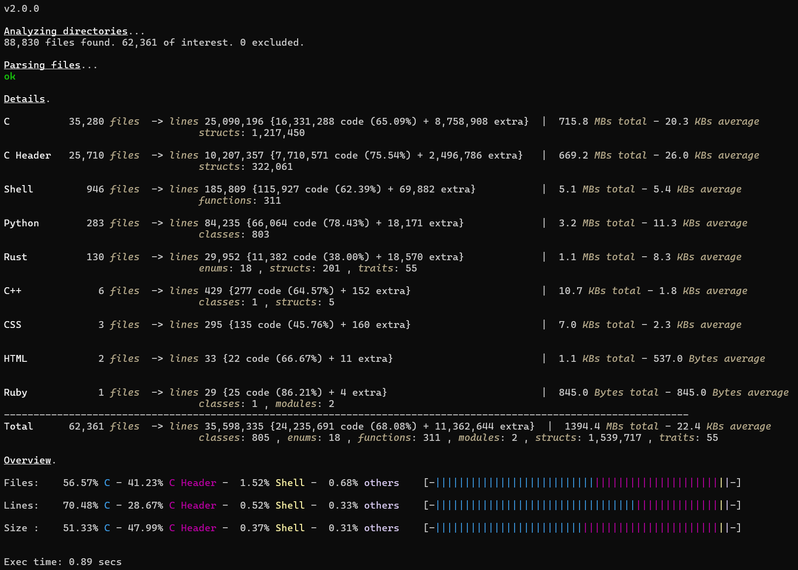
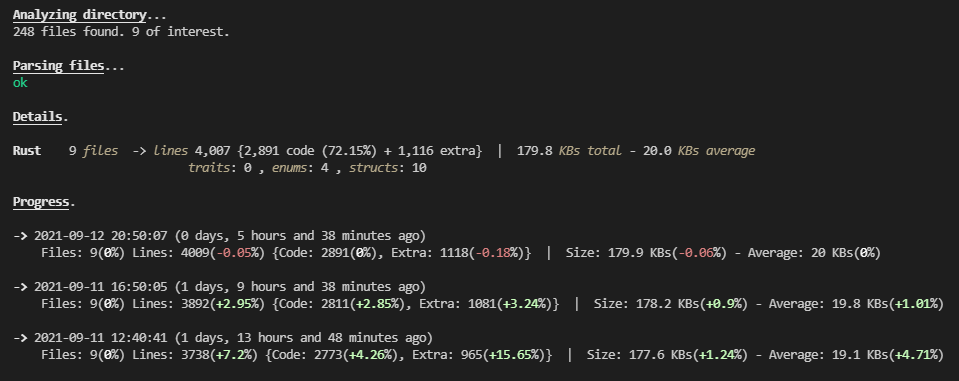
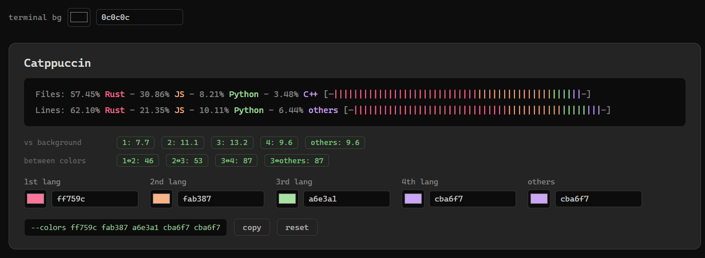

# mezura

## About
This is a fairly <b>fast</b>, fairly <b>accurate</b>, very <b>customizable</b> stats generator for programming projects, in the form of a CLI executable, written in <b>Rust</b>.
It is used for counting total lines, code lines, user defined <b>keywords</b> like classes, enums, etc., visualize the statistics, and to track the growth of codebases.<br><br>
It is maintained on <b>Windows</b>, but it is expected to work on <b>Linux</b> and <b>MacOS</b>.

Example run on entire Linux Kernel: </br>



## Table of contents
* [How To Run](#how-to-run)
* [Details](#details)
* [Cmd Commands](#cmd-commands)
* [Scripting](#scripting)
* [Configuration Files](#configuration-files)
* [Logs and History](#logs-and-history)
* [Themes](#themes)
* [Supported Languages](#supported-languages)
* [Accuracy and Limitations](#accuracy-and-limitations)
* [Windows Performance Note](#windows-performance-note)
* [Similar Projects](#similar-projects)


## How To Run
The only thing you need is the binary, and there are 3 ways to get it:

### 1. Install it with cargo
```bash
cargo install --locked --git https://github.com/subamanis/mezura
```
To update an existing installation to the latest version, just run the same command again: it will detect that the repository has new commits, rebuild, and replace the old binary.

### 2. Build it yourself
After cloning or downloading the repo:
```bash
cargo build --release
```

### 3. Download the prebuilt binary
Grab the one for your platform from the [latest release](https://github.com/subamanis/mezura/releases/latest).
Windows, Linux and macOS binaries are built and tested on every tagged version.

<br>

And to run it:
```bash
mezura <optional_path> --optional_command1 --optional_commandN
```

The program expects none or many paths to some directories or code files, separated by comma, if more than one.
If no path is provided, the current working directory will be assumed as target directory.

The program also accepts a lot of optional flags to customize functionality, see [Cmd Commands](#cmd-commands) for more info or use the --help command.


## Details
The generated stats are the following:
- Number of files
- Lines, split into code, comments and everything else, with percentages
- Size (total and average) 
- Keyword occurrences
- Percentage comparisons between languages
- The same figures grouped by a named part of the project, if you name one (see the modules section of ```--dirs```)
- Difference of stats between executions 

By default, the files and folders that are ignored by a .gitignore are skipped, so that build artifacts and dependencies don't pollute the stats (see the ```--no-gitignore``` command).

There is a "data" folder in the repository, that contains some already provided language files, themes and the default configuration file.
The program, at compile time, includes the "data" folder in the binary, and during the first execution, it saves it with the same structure in a persistent path, inside the user's computer, according to the platform's specification. More specifically, the paths per operating system are:
```
    Windows:  %APPDATA%\mezura
    Linux:    /home/$USER/.local/share/mezura
    MacOs:    /Users/$USER/Library/Application Support/mezura
```

After every subsequent execution, the languages, themes, configurations and logs, are read from these folders, so the user can have easy access and modify them,
like add more languages of his choice, add custom themes, or modify the default configuration.

Installing a new version updates the language files there, so a correction to a language reaches you without you having to do anything. One that you changed yourself is replaced too, since a language file that has fallen behind counts wrongly, but your copy is kept under ```data/replaced/<version>/<date and time>/``` and the program names it, so you can carry your changes over. Each update or ```--restore``` writes its own folder there, so two of them never mix and the newest is the one at the bottom. A language file of your own is never touched, and neither are your themes, your default configuration or ```extension_priority.txt```: those are written when they are absent and left alone afterwards.

In order for a file to be considered for counting, some language file in the "data/languages" dir must claim it, either by its extension or by its whole name, in the 'Extensions' or 'Filenames' field, see [Supported Languages](#supported-languages).


## Cmd Commands
Below there is a list with all the commands-flags that the program accepts.
```
WHAT IS COUNTED

--dirs

    The paths to the directories or files, separated by commas if more than 1,
    in this form: '--dirs <path1>, <path2>'
    A path can also be a glob pattern (* ? [..] {..}), which is expanded to every existing
    directory and file that it matches, so 'services/*/src' is a valid target.
    A path that exists exactly as written is always taken literally, so a folder with one of
    those characters in its name is still just a folder.
    Since the matches of a pattern are found by the program and not named by you, they follow
    the same rules as every other path it discovers: the ones that a .gitignore ignores, that
    are dotted, or that are links, are skipped (see the '--no-gitignore' and '--search-in-dotted'
    commands).
    A path that you write out explicitly is always used, even if it is ignored, dotted or a link.
    Targets that are contained in other targets are dropped, so that no file is counted twice.
    If you are using Windows Powershell, you will need to escape the commas with a backtick: `
    or surround all the arguments with quotation marks:
    <path1>`, <path2>`, <path3>   or   "<path1>, <path2>, <path3>"

    MODULES

    A target can be given a name, and then the report is grouped by it as well as by language,
    which answers 'how much of this is the frontend' without running the program once per folder:

        mezura frontend=./web backend=./api
        mezura ./project tests=./project/tests

    A comma continues the list of paths of the same module and a space ends it, so
    'tests=./api/tests,./web/tests' is one module of two directories, while 'frontend=./web ./ui'
    is the module and a separate unnamed target. Repeating a name adds to it.
    Every file belongs to exactly one module, and the most specific path wins, so the second
    example above means 'the tests there, the rest of the project here', whichever order they are
    written in. Anything the named ones did not claim is one row called '(unnamed)', and it comes
    last. The rest appear in the order you wrote them, which is how you arrange the columns of the
    'matrix' layout: '--sort' orders the languages inside a module and never the modules themselves.
    Declaring the same path under two different names is refused, since there is nothing more
    specific to settle it. A run that names nothing prints exactly what it always did.

    A space only ends a target once you have named one. While no name is given, a path is allowed
    to contain spaces and only a comma separates two of them, which is the way it has always been.
    That does leave one thing a command line cannot say, a path with a space in it in a run that
    also names modules, because your shell removes the quotation marks before the program sees
    them. Write those in a configuration file, one target per line, where a space never separates.

    The target directories can also be given implicitly (in which case this command is not needed) with 2 ways:
    1) as the first arguments of the program directly
    2) if they are present in a configuration file (see '--save' and '--load' commands).

--exclude

    1..n glob patterns separated by commas.

    A pattern without a slash matches a file or folder name at any depth ('node_modules', '*.min.js').
    A pattern with slashes matches the end of the full path, anchored at path components
    ('Rusty/mezura' matches '.../Rusty/mezura' but not '.../aRusty/mezura'). Full absolute
    paths work too. Glob syntax is supported in both forms: * ? [..] {..}
    Matching folders are skipped entirely; the files inside them are not traversed and
    are not included in the reported count of excluded files.

    If you are using Windows Powershell, you will need to escape the commas with a backtick: `
    or surround all the arguments with quotation marks:
    <arg1>`, <arg2>`, <arg3>   or   "<arg1>, <arg2>, <arg3>"

--languages

    1..n arguments separated by commas, case-insensitive

    The given language names must exist in any of the files in the 'data/languages/' dir as the
    parameter of the field 'Language'.

    Only the languages specified here will be taken into account for the stats.

--exclude-languages

    1..n arguments separated by commas, case-insensitive

    The given language names should exist in any of the files in the 'data/languages/' dir as the
    parameter of the field 'Language'.

    The given language names will be ignored from the stats calculation, if they exist.

--force-language

    1..n pairs of 'extension=language' or 'filename=language' separated by commas, case-insensitive

    Decides which language an extension is counted as, whether or not another language claims it:
    '--force-language m=matlab,pl=perl,txt=python'

    A whole filename works the same way, for the files that have no extension worth reading:
    '--force-language Makefile=python,Jenkinsfile=groovy'

    Overrides the 'extension_priority.txt' file of the data dir.

--no-gitignore

    No arguments in the cmd, but if specified in a configuration file use 'true' or 'yes' to enable,
    or 'no' to disable. Default: no

    By default, the program respects .gitignore files: any file or folder ignored by a .gitignore
    found in the traversed directories (or in their parent directories, up to the repository root)
    is skipped, and skipped files are included in the excluded files count. Negated patterns
    ('!keep.log') are supported, and target paths that are written out explicitly are always used,
    even if a .gitignore of their parent directories would ignore them. The matches of a glob
    pattern do not count as written out explicitly, since the program is the one that found them.

    This flag disables that behavior, so that every relevant file is counted
    regardless of .gitignore rules.

--search-in-dotted

    No arguments in the cmd, but if specified in a configuration file use 'true' or 'yes' to enable,
    or 'no' to disable. Default: no

    Specifies whether the program should traverse directories that are prefixed with a dot,
    like .vscode or .github.

    The '.git' directory is never traversed, with or without this command, at any depth. Nothing
    inside it is source, and walking it is thousands of files for no count at all.

--braces-as-code

    No arguments in the cmd, but if specified in a configuration file use 'true' or 'yes' to enable, or 'no'
    to disable. Default: no

    Specifies whether lines that carry no content should be considered as code lines or not.
    A line carries no content when nothing but punctuation is left on it once the strings and
    the comments are taken out: '}', '});', '],', ')'.

    The default behaviour is to not count them as code, since it is silly for code of the same content
    and substance to be counted differently, according to the programmer's code style.
    Writing 'if (x) { do(); }' on one line or on three should not change the number.
    This helps to keep the stats clean when using code lines as a complexity and productivity metric.

    Note that other line counters count these lines as code, so this is where their number and
    mezura's differ. Enabling this flag makes the two closer.

--show-languages

    No arguments.

    Overrides normal program execution and just prints a sorted list with the names of
    all the supported languages that were detected in the persistent data path
    of the application, where you can add more.

HOW THE REPORT LOOKS

--layout

    One argument: 'table', 'boxed', 'list' or 'matrix'. Default: table

    Chooses the shape of the "details" section.

      table     one aligned row per language: Language, Files, Lines, Code, Comments, Extra
                and Size, with a percentage next to each of the first four. No borders, only
                whitespace alignment, so it survives being pasted into a README or a ticket.
      boxed     the same figures inside a drawn frame. Each number shares a cell with its
                percentage there, since the borders already group the two, which makes it
                narrower than 'table'. Needs a terminal that can render box drawing
                characters.
      list      one block of three rows per language: the file count and the size above the
                name, the line breakdown beside it, the keywords below. Wider, and it cannot
                be read down a column, but it reads well for a handful of languages.
      matrix    languages down, modules across, one number per cell. The other three answer
                'what is inside the backend', read down a section; this one answers 'how do
                the modules compare on the same language', read along a row, which is what
                you want when the folders you named are several answers to one problem rather
                than several parts of one thing. Only one number fits in a cell, so it holds
                whatever '--sort' is ordering by, and a line above the table says which.
                A dash is a language the module does not have. With no module named there is
                nothing to cross, so it says so and prints 'table' instead.

    The percentage next to 'Files' and to 'Lines' is that language's share of the total, the
    one next to 'Code' and to 'Comments' is its share of that language's own lines, which is
    what the same two numbers mean in the 'list' layout.

    In the two tables the keywords cannot be a column without destroying the alignment, so they
    are printed as their own block underneath, one line per language. '--hide keywords' still
    suppresses them.

--sort

    One argument: 'lines', 'files', 'code', 'size' or 'name'. Default: lines

    Chooses the order of the languages in the "details" section, which also decides which of them
    reach the "overview" section and which are folded into its 'others' entry.
    Every criterion except 'name' sorts from the largest down, and ties are broken alphabetically
    so that the order never changes between runs on the same data.

    Note that before v3.0.0 the order was a fixed formula in which the byte size dominated, so
    runs that used to be ordered by size are now ordered by lines unless you ask otherwise.

--top

    One number, 1 or greater.

    Shows only that many languages in the "details" section, the ones that come first according
    to the '--sort' criterion. A line underneath states how many were hidden, so that the numbers
    not adding up to the total is never a mystery.

    The total keeps counting every language, hidden ones included, since it is the total.
    The "overview" section never shows more languages than this either, so asking for the top 2
    does not leave a third one sitting in the bar.

    It never reorders the modules themselves, only the languages inside them: you chose that order
    when you wrote them.
    With modules, the cut happens inside each one, since that is what the rows under a module are.
    The 'matrix' layout is the exception: its rows are the languages of the whole run, so there the
    cut is over all of them.

--hide

    One or more names separated by commas or spaces, for example:
    --hide parsing-info,timing   or   --hide parsing-info timing

    Leaves the named parts of the output unprinted. What you can hide:

      version         the version line at the top
      directory-info  the 'Analyzing directories' line and the 'N files found' line under it
      parsing-info    the 'Parsing files' line and the 'ok' under it
      progress-bar    the bar, the share done and the speed figures of a long parse, keeping
                      its file count
      animations      every moving line: the scan's dots, the live progress bar, and the
                      'Writing out', 'Counting' and 'Cleaning up' lines of a '--diff'. What
                      they settle into still prints. A TERM=dumb terminal gets this on its own
      keywords        the keyword counts, keeping the rest of the details rows
      overview        the whole percentages section
      bar             only the [-|||-] bar of the overview, keeping the percentages and the colors
      history         the comparison with previous runs (the same as '--compare 0')
      timing          the execution time line at the bottom

    The list mixes whole sections with parts of them on purpose: you are pointing at what you
    see, not at how the program is organised.

    Errors and warnings are never hidden. Hiding the parsing info still reports files that failed
    to be parsed, since otherwise the numbers would silently be wrong.

    Replaces the '--no-visual' and '--no-keywords' commands of previous versions.

--theme

    One argument, the name of a theme (case-insensitive).

    Applies a named theme. Themes are .txt files in the 'data/themes' dir, in the persistent
    data path of the application, where the file name is the theme name. Every line is a
    'token = value' pair, the same tokens and values that '--style' takes (see '--help style').
    You can add your own there, and '--show-themes' lists the ones you have.

    A theme carries only how the output looks. What is measured and what is shown stays in a
    configuration file, so a theme can be handed to someone else without carrying your paths
    or your settings with it.

    A style that does not parse is reported and skipped, and the rest of the theme still applies.
    A name that matches no file is an error, since that one is a mistake in the command.

--style

    One or more 'token=style' pairs separated by commas, for example:
    --style code-number=bright-black,code-label=b5a98a italic,heading=white bold underline

    Overrides how a category of printed text looks. A style is a color and any number of the
    attributes 'bold', 'italic', 'underline', 'dim' and 'reverse', in any order. The color is
    either a hex value or one of the 16 terminal color names (the same grammar as '--colors'),
    or the word 'default' to leave the terminal's own foreground color alone.

    'reverse' swaps the text and background colors, so it stands out strongly without committing
    to any color of its own, which means it adapts to whatever theme the terminal is using.

    The cells of the live progress bar take two forms no other token does, being a run of cells
    rather than one piece of text: two or more hex values separated by '..' fill them with a
    gradient through every one of them, evenly spread, and 'rainbow' walks a spectrum along them
    while they are drawn. A gradient takes hex values only, because a terminal color name is
    whatever the terminal's own scheme maps it to and there is no shade to interpolate. Every
    other token takes one color and says so if it is given either form.

    Every counted quantity owns two tokens, one for the number and one for the word beside it,
    so either can be picked out without touching the other. Each is named after the word that
    appears on screen:

      files-number       files-label
      lines-number       lines-label
      code-number        code-label
      comments-number    comments-label
      extra-number       extra-label
      total-size-number  total-size-label
      avg-size-number    avg-size-label
      keyword-number     keyword-label

    'size-unit' is the unit next to a size, the 'KBs' of '430.5 KBs total', and it is one token for
    both sizes since there is no reason to want two colors of KBs on one line. It is separate from
    the labels so that it can stay quiet while 'Size' reads like every other column header.

    The numbers of the "history" section are the same quantities, so they follow the same tokens.

    The rest, by where they appear.

    The page:
      version                  the version line at the top
      heading                  the section titles and the 'Analyzing directories' lines
      separator                the dashed line above the total
      summary                  the found / of interest / excluded line
      note                     the '(+N more languages hidden by --top N)' line
      success                  the 'ok' after parsing
      warning                  warnings
      error                    errors
      footer                   the execution time line

    The details tables:
      details-language-header  the word 'Language' over the first column of the two tables
      details-language-name    the name of a language, in a row and in the keywords block
      details-module           the name of a module, wherever one is printed
      details-total            the word 'Total'
      percent                  the percentages of the details rows
      arrow                    the '->' after a language name, in the 'list' layout only

    The overview:
      overview-label           the 'Files:', 'Lines:' and 'Size :' row labels
      overview-percent         the percentages of the overview
      bar-frame                the brackets around the overview bar and the live one
      language-1               the first language, its name and the color of its bar cells
      language-2               the second
      language-3               the third
      language-4               the fourth, shown only when nothing was folded into 'others'
      language-others          the folded 'others' entry. A theme that names 'language-4'
                               and not this one gets the same style here, since the two
                               never appear together

    A figure that moved, in the history section and in a '--diff' comparison alike:
      change-up                an increase
      change-down              a decrease
      change-same              no change

    The history section, which compares this run with the ones before it:
      history-entry            the '->' of an entry
      history-modified         the word 'modified:' on an entry counted with other settings
      history-modified-field   the names of the settings that changed since that entry

    The live lines, which only a terminal ever sees:
      progress-bar-fill        the cells the progress bar has drawn
      progress-bar-empty       the cells it has not reached, a faint track behind the whole
                               bar. 'default' takes the track away and leaves them blank
      progress-bar-figures     the file counts, the share done and the speed figures

    Only the color of a 'language-' token reaches the cells of the overview bar; bold, italic and
    the rest apply to the language name alone.

    The same tokens can be declared in a theme file and in the style block of a config. They are
    applied as one ladder of increasing specificity: the built-in defaults, then the theme, then
    this project's config, then '--style' for this run. So a theme can ship a complete look, your
    own config can keep a few tweaks that survive switching themes, and '--style' wins over both.

--bar-thickness

    One argument: 'slim', 'medium', 'fat' or 'low'. Default: medium

    Chooses the character that the percentage bar of the "overview" section is drawn with.

      slim     |   the only one made of ASCII, so it is the one that is guaranteed to
                   render on every terminal
      medium   ┃   the default, thicker, but still leaves gaps between the strokes
      fat      █   fills the cell, so the boundary between two language colors is crisp
      low      ▄   fills only the bottom of the cell, a thin band under the text

    All but 'slim' need a terminal and a font that can render box drawing characters.
    If the bar comes out as question marks or empty boxes, use 'slim'.

--progress-bar

    One argument: 'smooth', 'blocky' or 'hash'. Default: smooth

    Chooses the characters that the live progress bar of a long parse is drawn with.

      smooth   ▏▎▍▌▋▊▉█   one unbroken bar, its tip gliding through eight sub-steps per cell
      blocky   ▪▮         separate boxes, each drawn narrower than its cell, so a small gap
                          falls between them
      hash     .:#        the only one made of ASCII, so it is the one that is guaranteed
                          to render on every terminal

    The bar only appears on a terminal, on a parse long enough to watch, with the share done
    beside it; '--hide progress-bar' keeps its file count and drops the rest.

--number-separator

    One argument: 'comma', 'underscore', 'dot' or 'none'. The character itself is also
    accepted, so '--number-separator _' is the same as '--number-separator underscore'.
    Default: comma

    Chooses the character that groups the digits of every printed number.

      comma        1,559,486
      underscore   1_559_486
      dot          1.559.486
      none         1559486

    The keyword row lists several figures next to each other, separated by commas, so
    'comma' is the one choice where a grouped number and the end of one are the same
    character.

--decimal-separator

    One argument: 'dot' or 'comma'. The character itself is also accepted, so
    '--decimal-separator ,' is the same as '--decimal-separator comma'. Default: dot

    Chooses the character that separates the decimals of every printed number: the sizes,
    the percentages and the execution time.

    It is free to be the same character as the one '--number-separator' groups the digits
    with, since both conventions are in use somewhere. Nothing that is written to a log
    file is affected, so a log stays readable by any version.

--show-themes

    No arguments, or one of 'slim', 'medium', 'fat' and 'low'. Default: medium

    Overrides normal program execution and just prints a sorted list with the names of all
    the themes that were detected in the persistent data path of the application, where you
    can add more, each one previewed on a sample of the real details rows and a mock overview.

    The preview follows '--layout', so it shows the shape a run would actually print.

    The optional argument draws the preview bar with the character that the '--bar-thickness'
    command would use, so that a theme can be judged the way it will be printed.

--theme-editor

    No arguments.

    Overrides normal program execution: generates an interactive HTML page with the language
    colors of every theme found in the persistent data path of the application, and opens it
    in the default browser. There, every color can be adjusted, with live contrast metrics and
    a mock overview drawn with the same bar character the program prints, and the result is
    turned into the five 'language-' lines of a theme file.

    Replaces the '--tune-palettes' command of previous versions.

TAKING THE RESULT ELSEWHERE

--output

    One argument: 'text' or 'json'. Default: text

    Chooses what mezura writes to its output. 'json' replaces everything, the status lines and
    the overview included, with a single JSON document, so that the run can be read by another
    program instead of by a person.

      mezura ./src --output json > stats.json
      mezura ./src --output json | jq '.total.code'

    The document carries the counts as plain numbers of lines and bytes: no thousands
    separators, no KB or MB, no percentages and no colors, whatever the rest of the settings
    say. '--sort' and '--top' still order and cut the list of languages, and the count of the
    ones left out is in the document. '--hide keywords' and '--hide timing' remove what they
    name, since it is either not counted or not measured; the rest of the '--hide' list names
    printed sections that a JSON run does not have.

    Warnings and errors are written to the error output, so no stray line can land inside the
    document, and the warnings are carried in it as well, under 'warnings'. Each one has a
    'code' that is safe to branch on and will not change wording under you, an 'affects' of
    'counts' or 'settings', the 'subject' it is about, and the readable 'message'. Ask whether
    any of them affects the counts to know whether the numbers can be trusted: a language file
    that could not be read means a whole language went uncounted, while an ignored setting does
    not touch a number. The list is there even when it is empty.

    A run that finds nothing to count still writes a valid document, with an empty list of
    languages and a total of zero.

    This is the one display setting that a configuration file cannot carry, so that no saved
    configuration can silently turn the output of every later run into JSON.

--log

    Can take 0..n words as arguments in the cmd.

    This flag only works if a configuration file is loaded. Specifies that a new log entry should be made
    with the stats of this program execution, inside the appropriate file in the 'data/logs' directory.
    If not log file exists for this configuration, one is created.
    All the provided arguments are used as a description of the log entry.

    A configuration file cannot declare it: logging is asked for per run, so that loading a
    configuration never writes an entry on its own. It does not apply to a '--diff' run either,
    since a comparison is not logged, and mezura says so instead of writing an entry.

--compare

    1 argument: a number between 0 and 10. Default: 1

    This flag only works if a configuration file is loaded. Specifies with how many previous logs this
    program execution should be compared to (see '--save' and '--load' commands).

    Providing 0 as argument will disable the history section (comparison).

    Every log entry records the settings that decide what is counted, and an entry that was written
    with different ones is marked 'modified:' followed by their names. The comparison is still shown,
    because the point is to say whether it can be trusted: a change of 'dirs' means the numbers came
    from another tree, while a change of 'braces-as-code' means lines moved between code and extra
    and the total did not. An entry written by a version that did not record a setting is never
    reported as having changed it.

--diff

    One argument: a reading, or two of them with '..' between, oldest first. A reading is the
    path of a JSON document that an earlier run wrote, or a git revision: a branch, a tag, or
    enough of a commit hash to be unique.

    Compares this run against that reading, or the two readings against each other. The
    comparison takes the place of the report rather than sitting under it, so no language is
    listed twice.

      mezura ./src --output json > baseline.json
      mezura ./src --diff baseline.json
      mezura ./src --diff main
      mezura ./src --diff v2.0.1..v3.0.0
      mezura --diff january.json..june.json

    A revision is counted on the spot, over its own files, with this run's settings and its
    targets: 'mezura ./src --diff main' counts what './src' held on 'main'. The targets must
    all be inside one git repository, and a directory the revision does not have counts as
    zero, so everything in it reads as new. What was found on disk decides which of the two a
    reading is: a name that is a file is a document, anything else is asked of git. A revision
    is any spelling git itself resolves: a branch, a tag, a hash, or a remote-tracking name
    like 'origin/main'. It has to have been fetched already; one that lives only on the remote
    needs a 'git fetch' first, mezura never touches the network.

    Counting a revision costs more than counting the same tree in place: the commit's files
    are first written out whole to a temporary directory, and a file written moments ago is
    slower to read back than one that has sat on disk. The checkout is removed in the
    background after the comparison prints. Size can also move when no line did: git writes
    the checkout with the line endings 'core.autocrlf' asks for, and a working tree saved
    with the other ending then differs by one byte per line, in Size and nowhere else.

    Only one '..' is allowed, and it is the separator. A path that climbs through one on its
    way to a file is taken whole when the file is really there, so '--diff ../old.json' reads
    as you would expect; two of them cannot be told apart from a separator and are refused, so
    write such a path out without the climb.

    Every figure carries what it is now and how much it moved, and the three counted in
    thousands carry the percentage as well; a file count and a size are read whole, so '+2
    files' is the answer there and a decimal point would be the same fact dressed up. A figure
    that did not move is a dash, so the eye goes to the rows that did. The columns that a plain
    run gives to each figure's share of the whole are what the change is written in, and
    'Extra' is gone, being the three columns beside it taken off the lines.

    The keywords are marked the same way, in the section they already have, and only where one
    moved: 'structs: 57 (+5), traits: 2'. The overview is not printed, being a picture of one
    reading, and neither is the history section, which is a comparison of its own against the
    log's entries: two of those under one another answer 'what changed since' twice with
    different pasts.

    '--sort' and '--top' order and cut the rows as they do everywhere else. The comparison is
    drawn as the table, or in the boxed frame with '--layout boxed'; 'list' and 'matrix' have
    nothing to show for one, and mezura says so and prints the table. A language that only one
    of the two readings has is marked 'new' or 'gone' instead of being given a percentage,
    since a count that grew out of nothing has none.

    The modules get a row each, with their languages under them, when the two readings named
    the same ones. When they did not, there is no module the two of them share: the comparison
    is of everything at once, and mezura says which each of them named. A module that one
    reading has and the other does not would have every language in it read as written from
    scratch or deleted whole, for files that in all likelihood only moved.

    A document records the settings the counting obeyed, and they reach whatever is counted
    against it: comparing against a baseline taken with '--braces-as-code' counts this run
    with it too, and says so, because the two readings would otherwise disagree about what a
    line of code even is and that difference would read as code that changed. A setting given
    on this very command line is kept instead, and the comparison then warns that the two
    readings were not taken the same way, as it does when two documents disagree with each
    other and there is nothing left to count. '--no-gitignore' never reaches a revision, and
    mezura says so: a checkout holds only what git tracks. The comparison also says so when
    the two readings were counted by different versions of mezura.

    A document written with '--top' is refused, because the languages it left out would read as
    languages that were deleted since. Write the baseline without it.

    With '--output json' the comparison itself is written as a document: the same vocabulary as
    a run's document, with every count carrying 'from', 'to' and 'change', and the two readings
    identified under 'from' and 'to' by their source, so a build step can ask questions like
    'did the code shrink' of the change directly. '--top' does not cut that document, being a
    decision about a screen.

    This is not a display setting a configuration file can carry, so that no saved
    configuration can silently turn every later run into a comparison.

YOUR DATA DIRECTORY

--save

    One argument as the file name (whitespace allowed, without an extension, case-insensitive)

    Doing so, will run the program and also create a .txt configuration file,
    inside 'data/config/' with the specified name, that can later be loaded with the --load command.

--load

    One argument as the file name (whitespace allowed, without an extension, case-insensitive)

    Associated with the '--save' command, this command is used to load the flags of
    an existing configuration file from the 'data/config/' directory.

    You can combine the '--load' and '--save' commands to modify a configuration file.

--save-theme

    One argument, the name of the theme file to write (case-insensitive, no extension).

    Writes everything about the way this run looks into a theme file: whatever theme was loaded,
    plus the style block of the configuration, plus any '--style' given on the command line, all
    flattened into values. The file stands on its own and can be shared as it is.

    Combined with '--save', the configuration that is written points at this theme by name and
    carries no styles of its own.

--show-configs

    No arguments.

    Overrides normal program execution and just prints a sorted list with the names of
    all the configuration files that were detected in the persistent data path
    of the application.

--restore

    No arguments.

    Overrides normal program execution and brings your data directory back to what this version of
    mezura ships: anything missing is written, and a language file that no longer says what ours
    says is replaced. It reports what it did.

    This already happens on its own when you install a new version, so you should not need it. It
    is here for when something was damaged or deleted within one version, where nothing else would
    notice.

    A language file you changed is replaced too, since one that has fallen behind counts wrongly,
    but your copy is kept under 'data/replaced/<version>/<date and time>/' and named, so you can
    carry your changes over. Each run of this writes its own folder there, so running it twice never
    mixes the two. A language file of your own is never touched, and neither are your themes, your
    default configuration or 'extension_priority.txt': those are written when absent and left alone.

TUNING AND DIAGNOSTICS

--threads

    2 numbers: the first between 1 and 32 and the second between 1 and 128.

    This represents the number of the producers (threads that will traverse the given directories),
    and consumers (threads that will parse whatever files the producers found).

    If this command is not provided, the numbers will be chosen based on the available threads
    on your machine.

    There are far more consumers than cores on purpose. A consumer spends most of its life waiting
    for a file to open, so what decides the speed is how many reads are in flight, not how many
    cores there are. Raising the number costs nothing on a fast disk whose files are already
    cached, and is worth up to twice the speed on a slow disk or on the first run after a reboot.
    If your files live on a slow drive, or you are counting a tree you have not touched today, it
    is worth trying a higher number than the default.

--show-faulty-files

    No arguments in the cmd, but if specified in a configuration file use 'true' or 'yes' to enable,
    or 'no' to disable. Default: no

    Sometimes it happens that an error occurs when trying to parse a file, either while opening it,
    or while reading its contents. A directory can also fail to be opened at all, most often because
    of its permissions, or because something removed it while the scan was running. The default
    behavior in both cases is to count them and display the count, since everything under a directory
    that could not be read is missing from every number in the report.

    This flag specifies that their path, along with information about the exact error is displayed too.
    The most common reason for a faulty file is if it contains non UTF-8 characters.

    It asks the same of '--output json', where the two lists of paths are written only when this
    flag is given. How many there were is in the 'scan' block either way, so a document without
    the lists never claims that nothing went wrong. A comparison document carries the counts of
    each side and no lists at all.

THE PROGRAM ITSELF

--help

    No arguments, or any number of other command names, written with their dashes:
    '--help --style --layout' explains those two and nothing else.

    Overrides normal program execution and prints this message.

--version

    No arguments.

    Overrides normal program execution and prints the version of this binary, with the date it
    was released on. An unreleased build says so instead of naming a date.

    Not to be confused with '--hide version', which only leaves the version line off the top of
    a normal run.

--changelog

    No arguments, or the optional argument 'full'.

    Overrides normal program execution and just prints a summary of the changes
    of the current version of the program. If 'full' is provided, the changes
    of every previous version are printed too, most recent first.
```


## Scripting

`--output json` writes a single JSON document instead of the printed report, so that a build step, a
badge or a dashboard can read a run instead of a person. Everything that is not the document itself,
warnings included, goes to the error output, so `mezura ./src --output json > stats.json` leaves a file
that a parser accepts. The document is written even when there was nothing to count, and even when
every file failed to parse: a consumer never has to tell "no output" apart from "no code found", and
a run that failed says so in the document instead of leaving an empty file.

```
mezura ./src --output json | jq '.total.code'
mezura ./src --output json | jq -r '.languages[] | "\(.name) \(.lines)"'
```

The counts are plain numbers of lines and bytes, with no separators, no KB or MB and no percentages:
those are decisions about a terminal and a consumer that wants them can compute them. `scope` echoes
the settings that can change a number, so that two documents are not compared when one of them was
produced with a different `--exclude` or with `--braces-as-code`. `format` is the version of the
document itself, separate from `mezura_version`, and it only moves when a key is removed or changes
meaning, so a parser can check that one and ignore which build wrote the file.

`faulty_files` names every file that was found and could not be parsed, and `unreadable_dirs` every
directory the scan could not open, whose whole contents are therefore missing from every number in
the document. Both are arrays of objects carrying the path and the reason, so a permission is told
apart from a directory that was deleted while the scan was running. Both are empty on an ordinary
run, and either being non-empty means the counts are short by something the document names. Both are always written in full, whether or
not `--show-faulty-files` was given: that flag is a decision about how much to print on a terminal,
and two runs over the same code have to produce the same document.

`warnings` carries what the run said on the error output, which whoever reads the document never
sees. Each entry has a `code` that is safe to branch on, a `message` that is safe to show and free to
be reworded, the `subject` it is about, and an `affects` of `counts` or `settings`. That last one is
the useful question: an unreadable language file means a whole language went uncounted, while a
setting that was ignored leaves every number intact, and a consumer can gate on it without keeping a
list of every code that exists.

```
mezura ./src --output json | jq -e '[.warnings[] | select(.affects == "counts")] | length == 0'
```

**Exit codes.** 0 means mezura ran and told you what it found, including when it found nothing,
because zero is an answer. 1 means the run failed: a mistake in what was asked for, a name that does
not exist, a set of files where every one of them failed to be parsed, or a scan that found nothing
after failing to open a directory, since that zero is not a count of anything. The failing cases
still write the whole JSON document, faulty files and unreadable directories included, so the
failure can be read and not only detected.


## Configuration Files
If we plan to run the program many times for a project, it can be bothersome to specify all the flags every time, especially if they contain a lot of target and exclude dirs.
That's why you can specify many flags in a <b>*configuration file*</b>, and have the program just load that file (see the --load command). <br>

Configurations can be created automatically by specifying all the flags once, along with the command "--save", and a name for the configuration. Then the program, along with its normal execution, will automatically create a config file with the name you specified, and dump all the flags in there. <br>
The next time you want to run the program on this project, you can do it like this: 
```mezura --load <config_name>``` <br>

By default, there is a configuration file name "default" already present in the "data/config" dir, that gets loaded on every run. There, you can customize your preferences and they will apply to all runs, except if overriden by explicitely providing a different flag in the cmd, or by loading a specific configuration. For example, if you prefer counting braces as code, you can specify it there, because the default behaviour is to not regard them as code. <br>

The priorities of the specified flags are:
1) cmd
2) Specific config file
3) Default config file
4) Internal defaults


## Logs and History
Inside the 'data/logs' folder, the program will save log files that correspond to saved configurations everytime the '--log' flag is used. <br>
A log is a .jsonl file: one JSON entry per line, the newest first, so it is read by any JSON tool one line at a time. Each entry records the date and time of the execution and the name of the log (if specified), the settings the run was counted with (the target directories, whether braces count as code, and so on, so you can see if at some point the configuration got modified), and the total files, lines, code lines, comment lines and size of the execution. <br>

A run that names its targets records its modules in the entry, and the history section then carries one narrow line per module: which of them grew, and by how much. A module that was not there last time, or that is not there any more, is named as such instead of being compared against nothing. An entry written by a run that named none has no such block. <br>

By using the '--compare <N>' flag, the (N) previous logged executions will be retrieved from the file and will be compared and printed to the screen. For example
for N = 3, it would look like this:


Note that a configuration file must be loaded for both '--log' and '--compare' to work.


## Themes
Everything the program prints can be styled: 46 tokens, each taking a color plus any of bold, italic, underline, dim and reverse. A color is either a hex value or one of the 16 standard terminal color names, which follow the color scheme of your terminal. Run ```--help style``` for the full list of tokens.

A **theme** is a plain .txt file of ```token = value``` lines, in the "data/themes" dir of the persistent data path. It carries only how the output looks, never what is measured, so it can be shared as it is. Apply one with ```--theme <name>```, list the ones you have with ```--show-themes```, and write the current look into a new one with ```--save-theme <name>```.

7 themes are bundled: **Mezura** (the default one), Dracula, Gruvbox, Catppuccin, Meadow, Neon and Ocean. Edit them, or add your own by dropping a file there.

The four languages of the overview and the folded 'others' entry are five ordinary tokens, ```language-1``` to ```language-4``` and ```language-others```, so a theme sets them the same way it sets everything else.

To make picking those five easier, there is an interactive editor, where every theme is previewed on a mock overview, every color can be adjusted (with live contrast and color distance metrics, so that the result stays readable), and the outcome is turned into the lines you paste into a theme file.

<b>[Open the theme editor online](https://subamanis.github.io/mezura/theme-editor/)</b> to play with the bundled themes, or run ```mezura --theme-editor``` to open it with the themes found on your own machine, including the ones you created.

<a href="https://subamanis.github.io/mezura/theme-editor/"></a>

## Supported Languages
Note that the default supported languages are incomplete, but they can be easily expanded by the user. All the supported languages can be found in the folder "data/languages"
as separate text files, in the persistent data path of the application. 
The user can easily specify a new language by replicating the format of the language files and customizing it accordingly, either by following the rules below or by copy pasting an existing file.

Header files have their own dedicated languages: `.h` files are counted under "C Header" and `.hpp` files under "C++ Header", since the program cannot know which codebase a header belongs to.

If two or more language files claim the same extension, the winner is the one named in the `extension_priority.txt` file of the data dir, which ships with an answer for every contest between the languages that come with the program. An extension that nobody has named there goes to the language that comes first alphabetically, and the program reports it, since that is a tie-break and not a decision. Either way ```--force-language``` overrides it for a single run or, through a configuration file, for a single project.

The format of the languages is as follows. **The blocks are read in this order and no other**: one that arrives where it is not expected makes the whole file unreadable, and the language is left out of the run. The blocks marked optional can be left out entirely, and you can specify an arbitrary amount of keywords. A string symbol goes in exactly one of the three string lists.

```
Language
<name of the language>

Extensions
<name of file extensions like cpp hpp or py, separated by whitespace>
<the value may be left empty for a language whose files are known by their whole name>

Filenames                                                                        (optional)
<whole names, for files an extension cannot describe, like: Makefile Dockerfile CMakeLists.txt>
<a file is matched by its name first, so CMakeLists.txt is CMake and not whatever claims .txt>

String symbols
<string symbols whose string ends at the end of the line, separated by whitespace, like: " ' >
<the value may be left empty, for a language whose quotes are not strings at all, like HTML>

Character literal symbols                                                        (optional)
<the symbol that holds a single character, like Rust's '. It counts as a literal only when it>
<closes on its own line and holds one character or an escape, so the quote inside a '"' opens>
<no string, while a lifetime's lone ' opens nothing and two of them on one line do not pair>

Multi line string symbols                                                        (optional)
<string symbols whose string crosses lines, separated by whitespace, like: """ ` >

Line continuation                                                                (optional)
<the symbol that joins a line to the next one when it is the last thing on it, like: \ >
Continues                                                            (with the symbol, or not at all)
<what the joining reaches: 'strings', 'comments', or both separated by whitespace. C splices>
<anything, so a line comment ending in a backslash carries on; JavaScript and Python continue>
<a string literal only, and their comments always end at the newline>

Paired string openers                                                            (optional)
<openers of strings whose closer is a different symbol, like: r#" >

Paired string closers                                                (with the openers, or not at all)
<their closers, one per opener and in the same order, like: "# >

Comment symbols
<one or more single line comment symbols, separated by whitespace, like: // # >
<the value may be left empty, for a language whose comments are all written in blocks>

Multi line comment start                                                         (optional)
<one or more block comment openers, separated by whitespace, like: { (* >
<the two characters =* stand for "any number of = here, including none", so writing --[=*[ and>
<]=*] declares Lua's --[[ ]], --[=[ ]=], --[==[ ]==] and every level above, all at once. They>
<are the one place in this format where characters do not stand for themselves, so a language>
<whose comment symbol really contains =* cannot be written down. They are read here and only>
<here: written under 'Nesting comment start' those two characters are taken literally, and the>
<symbol then matches nothing>

Multi line comment end                                                (with the starts, or not at all)
<their closers, one per opener and in the same order, like: } *) >

Nesting comment start                                                            (optional)
<openers of block comments that nest inside themselves, like: /+ >

Nesting comment end                                                   (with the starts, or not at all)
<their closers, one per opener and in the same order, like: +/ >

Keyword                                                                          (optional)
    NAME
    <the name of the keyword to be shown in the results, like: classes>
    ALIASES
    <any word that constitutes an instance of this keyword, like: class, record>
Keyword
    NAME
    <the name of the keyword to be shown in the results, like: classes>
    ALIASES
    <any word that constitutes an instance of this keyword, like: class, record>
```

	
## Accuracy and Limitations

Before the details, the one decision that explains most of the difference between mezura's numbers and another counter's: **mezura asks what a line says, not where it sits.** A blank line inside a block comment is blank, not comment, because it tells you nothing about the documentation around it. A line holding only ```}``` or ```);``` is neither code nor comment, because the language required it and the programmer said nothing by writing it. Counters that group by region answer the other question, "which block is this line inside", and give the blank line to the comment and the brace to the code. Neither reading is wrong, they answer different questions, and it is worth knowing which one you are reading: with mezura, ```code``` and ```comments``` do not add up to ```lines```, and what is left over is the part of the file that carries nothing. ```--braces-as-code``` moves the punctuation-only lines into code for anyone who wants the other convention.

The program is able to understand and parse correctly arbitrarily complex code structures with intertwined strings and comments. This way it can identify if a line contains something other than a comment, even if the comment is partitioned in multiple positions and it can identify valid keywords, that are not inside strings or comments.
For example in a line like ```/*class"*/" class" aclass```, it will not count "class" as a keyword since the first is inside a comment, the second inside a string and the third has a prefix.
Additionally:
- It checks for escaped characters, for example ```/"``` will not be counted as a string symbol
- It resolves symbols that are side by side, for example ```*/*``` is normally identified as both a closing and an opening comment symbol, but the program will understand the correct usage.
- A language that writes comments in more than one way gets all of them, and each one ends only with its own closing symbol. Pascal writes ```{ }``` and ```(* *)```, D writes ```/* */``` and ```/+ +/```, and a stray ```*)``` inside a ```{ }``` comment is just text.
- A comment written inside another comment does not end it early. This is how OCaml, Rust, Haskell, F#, Scala, Kotlin, Swift, Julia, Elm, Lisp, Scheme, MATLAB and WebAssembly text read their own code, so commenting out a block that already had comments in it counts as the comment it is. In C and the languages that follow it the first ```*/``` really does end the comment, and that is what the program does there.
- Lua's ```--[==[``` comments are read to their real end, so a ```]]``` written inside one is text.
- A comment that ends and another that begins on the same line (```]]--[[``` in Lua, ```--><!--``` in HTML) are read as two comments.
- Strings are read with the same care. A quote left open by mistake costs its own line instead of everything below it, a Python docstring or a JavaScript backtick still runs for as many lines as it likes, and the raw forms that end with a different symbol than they started with, like Rust's ```r#"..."#``` or C#'s ```@"..."```, end where the language says they do even when they finish with a backslash.

With that said, it is important to mention the following limitations:

- A file is counted as one language from beginning to end. A ```.php``` file with html and js in it, a Vue or Svelte component with its three sections, a ```<script>``` block inside a page: all of them are read with the symbols of the language the file belongs to, so a comment written in the inner language may not be recognised as one. This is not a wall, it is simply not built yet: it needs a language file to say where the other language begins and ends, and the counter to switch over and back.

- Keywords are counted as words, not as meaning. Wherever ```class``` appears as a word in code it is counted, and in a language that uses the same word for a second purpose those occurrences are counted too. Mezura has no idea what a declaration is; it knows where the code is and which words you asked it to look for.

- If a target path contains another target path, the contained one is dropped, so that its files are not counted twice. A symbolic link (or a Windows junction) that the scan comes across is not followed, for the same reason: whatever it points at would be counted a second time through it. The same goes for one that a glob pattern matched, since those are found by the program rather than named by you. One that you name as a target yourself is followed, since that is what you asked for. Hard links are the case that stays: they are indistinguishable from an ordinary file, so the same content reached through two of them is counted twice.

- A string delimiter that the programmer invents on the spot cannot be written in a language file, since it is different every time it is used: a shell or PHP heredoc, a PowerShell here-string, Rust's ```r##"..."##``` past the one-hash form, and for now Lua's ```[[ ]]``` strings. What is inside them is plain text to the language, while mezura is still counting quotes in it, so one apostrophe in an ordinary sentence written inside a heredoc is enough to look like the start of a string. In most languages the damage ends with that line. In the ones where a string may legally run over several lines (Rust, Ruby, the shells, PHP, SQL and their kin) mezura cannot tell a long string from a lone quote, and everything below reads as string content until the next quote turns up.

- Everything in a language file stands for itself, with one exception: the two characters ```=*``` inside a comment symbol mean "any number of ```=``` here". It is what lets a single line declare Lua's ```--[[```, ```--[=[``` and ```--[==[``` together, and it is a small cheat: a language whose comment symbol really contained ```=*``` could not be written down. No such language is known, and if one turns up the marker moves to a block of its own.

- Extensions are matched without regard to case, so a file named ```MAIN.RS``` is counted as Rust, and so is one named ```main.rs```. The one thing this loses is the Unix convention where an upper case ```.C``` means C++ while ```.c``` means C: to mezura they are the same extension.

- When two languages claim the same extension or the same filename, only one of them can have it, and the choice changes the numbers rather than only the label, since the loser's files are then parsed with the winner's comment and string symbols. Mezura makes no attempt to settle it by looking inside the files: a guess from the contents would be right most of the time, and the times it was wrong it would be wrong quietly, in the middle of a run, differently for two files with the same extension. So it takes the answer from you and says so every time it has no answer to take. To decide it once, name the winner in the ```extension_priority.txt``` file of the data directory, under ```contested-extensions``` or ```contested-filenames```; to decide it for one run or for one project, use ```--force-language```, which overrides that file and takes a filename as readily as an extension.

- A regular expression written inside a string is read as a string, escapes included, and creates no inaccuracy. A regex literal, in the languages that have them, can miscount in one way: a comment opener sitting inside it, like the ```/*``` of JavaScript in ```/a[/*]b/```, reads as a comment that has opened, so the lines after it are counted as comment until something closes it. A bare quote inside a regex costs nothing, since those languages declare their quotes as ending with the line.


## Windows Performance Note

Opening a file is far more expensive on Windows than on Linux: every open walks the object manager, the security descriptor and the whole filter driver stack, which is where antivirus and other minifilters sit. Since mezura opens one file after another, this dominates: **on Windows the program is I/O bound, and most of its time is spent waiting on `File::open` rather than counting anything**. On Linux the same open is cheap, so the program is parsing bound and the time goes where it should, into the parser.

The practical consequence is that the same repository on the same machine is measurably faster to analyze from Linux (~2x speedup), and that on Windows the biggest wins come from removing work from the open path rather than from making the parser faster. Worth knowing when reading a profile of your own: a thread that is waiting for a core, and not for the disk, is still counted as waiting inside the open it was about to make, so a large `File::open` share is a question rather than a verdict.

That baseline cost is structural and does not go away. What can be removed is what sits on top of it: because every open traverses the filter stack, real-time antivirus protection ends up inside mezura's hot path, inspecting each file as it is opened, and it multiplies an already expensive operation. Excluding mezura from that scanning does not make Windows open files as cheaply as Linux does, it only removes the worst amplifier, which on a large tree is the difference between not-as-fast-as-could-be and slow.

### Removing the antivirus overhead
To exclude mezura from Windows Defender real-time scanning:

1. Open PowerShell as Administrator
2. Run:
   ```powershell
   Add-MpPreference -ExclusionProcess "mezura.exe"
   ```
3. Restart your terminal

To remove the exclusion later:
```powershell
Remove-MpPreference -ExclusionProcess "mezura.exe"
```

**Note:** This is a common requirement for file-scanning tools (similar to build tools, IDEs, etc.). Only add this exclusion if you trust the source of the executable.

**The exclusion is matched on the exact filename**, so a copy you renamed to anything else does not have it, and on this machine that alone measured 1.28x on a large repository with byte-identical binaries. Worth knowing if you keep several builds around, or if you ever time one against another.


## Similar Projects

If you don't require the keyword counting functionality of this program, the history tracking feature, or the alternate-than-usual visualization, use the [scc](https://github.com/boyter/scc) project written in GO, that is honestly impressive.

Other alternative projects you can check are:
- [loc](https://github.com/cgag/loc)
- [cloc](https://github.com/AlDanial/cloc)
- [sloc](https://github.com/flosse/sloc)
- [tokei](https://github.com/XAMPPRocky/tokei)

<br>

## License

Licensed under either of

- Apache License, Version 2.0 ([LICENSE-APACHE](LICENSE-APACHE) or https://www.apache.org/licenses/LICENSE-2.0)
- MIT license ([LICENSE-MIT](LICENSE-MIT) or https://opensource.org/licenses/MIT)

at your option.

Unless you explicitly state otherwise, any contribution intentionally submitted for inclusion in
this work by you, as defined in the Apache-2.0 license, shall be dual licensed as above, without any
additional terms or conditions.
